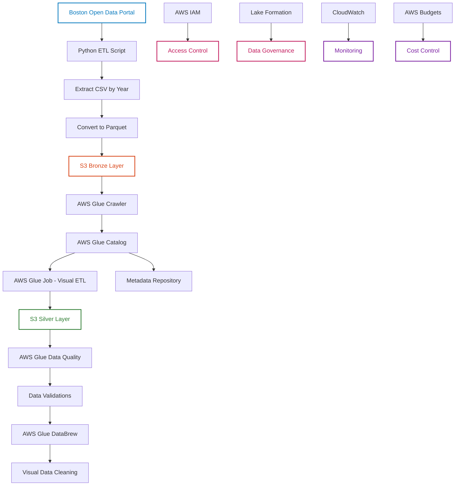

# 🏙️ Boston Data Lake Project (AWS Medallion Architecture)

This project demonstrates the construction of a data ingestion, organization, and transformation pipeline using AWS services, based on the Medallion architecture (Bronze, Silver). The data used comes from the open data portal of the city of Boston (USA).

---

## 📌 Objective

Create a modern data ingestion solution using key managed AWS services. The pipeline follows data engineering best practices, with layered separation, versioning, quality control, and data transformation.

---

## ⚙️ Technologies and Services Used

- 🐍 **Python** — for initial data ingestion and transformation
- ☁️ **AWS S3** — layered storage (Bronze and Silver)
- 🔐 **AWS IAM** — access permission control
- 🧭 **AWS Lake Formation** — data lake governance and security
- 🕷 **AWS Glue Crawler** — automatic schema detection
- 📚 **AWS Glue Catalog** — central metadata repository
- 🧪 **AWS Glue Data Quality** — data integrity validation
- ⚗️ **AWS Glue Jobs (Visual ETL)** — data transformation to the Silver layer
- 🧼 **AWS Glue DataBrew** — visual data cleaning and harmonization
- 📊 **CloudWatch & AWS Budgets** — monitoring and cost control

---

## 🧱 Pipeline Architecture



---

## 📥 Data Ingestion

The data was collected directly from the Boston open data platform, covering the years 2020 to 2025. The Python script downloads the CSV files, converts them to Parquet format, and uploads them to the Bronze layer of the S3 bucket.

---

## 🧪 Data Quality

We assessed the quality of the Silver layer using AWS Glue Data Quality, with metrics such as:

- Required field validation
- Null value checks
- Consistency rules automatically suggested by Glue

---

## 🧼 Harmonization with AWS Glue DataBrew

We used Glue DataBrew to apply no-code visual transformations, including:

- Column standardization
- Date format conversion
- Cleaning of null and inconsistent fields

---

## ▶️ How to Run the Project Locally

Clone this repository:

```bash
git clone https://github.com/joaoacf1/boston-data-medallion-lake.git
```

Create a `.env` file at the root with your AWS credentials:

```env
AWS_ACCESS_KEY_ID=YOUR_KEY
AWS_SECRET_ACCESS_KEY=YOUR_SECRET
REGION_NAME=us-east-1
```

Install the dependencies:

```bash
pip install -r requirements.txt
```

Run the script:

```bash
python etl.py
```

---

## 💡 Learnings and Skills Demonstrated

- 🧠 Understanding of layered Data Lake architecture
- 🛠️ Hands-on experience with core AWS services for data engineering
- 🧼 Data transformation and harmonization with and without code (Glue Jobs and DataBrew)
- 🔒 Secure permission setup using IAM and Lake Formation
- 📊 Cost monitoring with AWS Budgets and CloudWatch 
